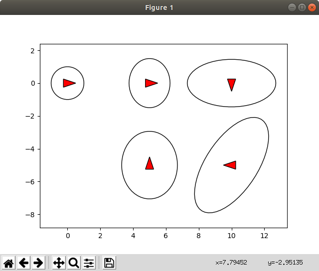

# Minisam - Python Example 

## What is Minisam?

> miniSAM is an open-source C++/Python framework for solving factor graph based least squares problems. - from [minisam documentation](https://minisam.readthedocs.io/)

## Installation 
 
* Python Installation

Among Various Python Virtial Environments, Anaconda is already tested, and venv failed. Choose your prefer considering referred earlier.

```bash
$ git clone --recurse-submodules https://github.com/dongjing3309/minisam.git
$ cd minisam
$ mkdir build
$ cd build
# enter your virtual env path
$ cmake .. -DPYTHON_EXECUTABLE=<your_python_env_path> -DMINISAM_BUILD_PYTHON_PACKAGE=ON -DMINISAM_BUILD_SHARED_LIB=ON

# for example
$ cmake .. -DPYTHON_EXECUTABLE=/home/swimming/anaconda3/envs/ai_robo_kr_env/bin/python -DMINISAM_BUILD_PYTHON_PACKAGE=ON -DMINISAM_BUILD_SHARED_LIB=ON

# make package then install
$ make python_package -j8
$ sudo make install -j8
```

* Check Installation

```bash
$ activate <your-env>
$ pip list | grep minisam
>> minsam 0.0.0 # success!!
```

## Examples

1. pose_graph_example.py

* reference documentation : [Simple 2D Pose Graph Example](https://minisam.readthedocs.io/pose_graph_2d.html)


<p align="center">
    
</p>
