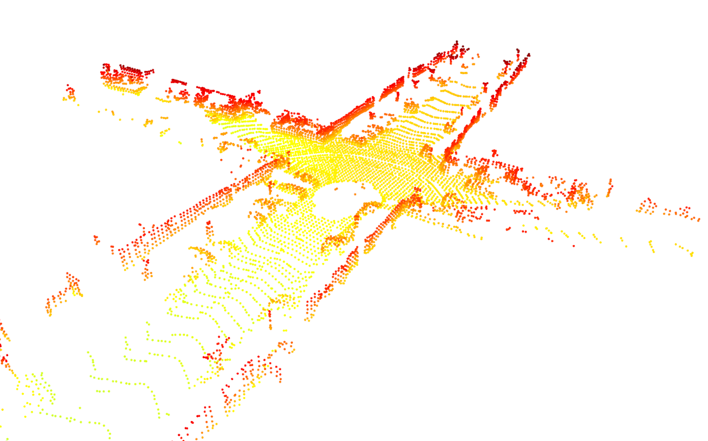
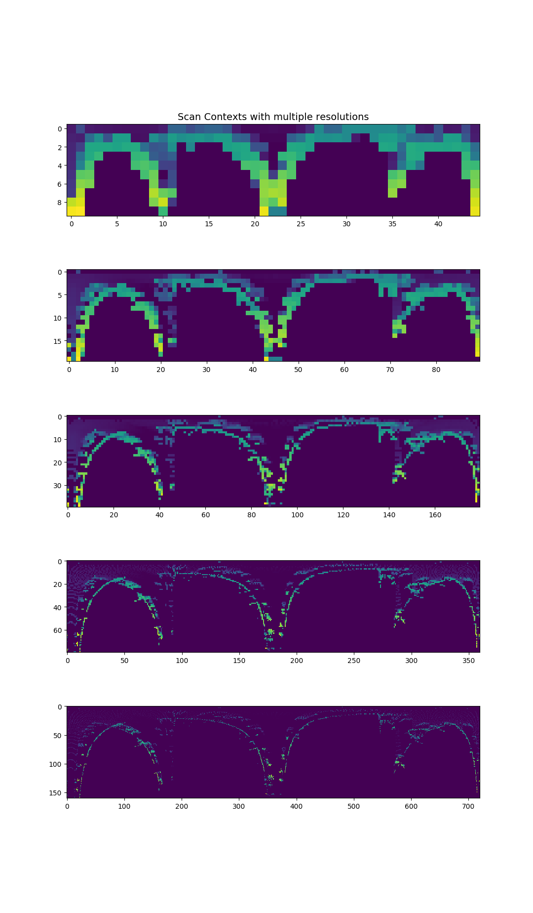

# ScanContext - Python Example 

All this examples based on original scancontext Repo

> Github Link : [`irapkaist/scancontext/python`](https://github.com/irapkaist/scancontext/tree/73908edbaf196b95edc4e71eae6a68d7f8857516/python)

## Folder Structure

```
├── data
│   └── 000095.bin
├── Distance_SC.py
├── make_sc_example.py
├── README.md
├── requirements.txt
└── result
    ├── ptcloud_filtered.png
    └── sc_multires.png
```

### First, It contains two python example codes

1. `make_sc_example` : Shows how ScanContext is build (Sometimes it's referred as **SC**)
2. `Distance_SC` : Calculate difference btw two **SCs** 

And it provides sample pointCloud data. which located in `data` folder.
During codes, There's an option to show rough shape of it. Here's an image for that.

<p align="center">
    
</p>

And, `result` folder also contains **SC** images with various resolutions.

<p align="center">
    
</p>


# How to use

1. Prepare python virtual environment

We recommend to use `Anaconda`, since we tested all those things on that. You can create your environments only for this example like this.


* Anaconda Setup
  
```bash
$ conda activate <your-conda-env>
$ cd Examples/ScanContext
$ pip install -r requirements.txt

# Finally Run Codes
$ python3 make_sc_example.py
# or 
$ python3 Distance_SC.py
```

## Code Explanation

1. **make_sc_example.py**

### Main

Read Velodyne Lidar Points from local directories. Read whole lists, make path as string, finally traverse them. `kitti_vlp_database` Class  handles all those stuffs.

```python
class kitti_vlp_database:
    def __init__(self, bin_dir):
        self.bin_dir = bin_dir
        self.bin_files = os.listdir(bin_dir)
        self.bin_files.sort()

        self.num_bins = len(self.bin_files)s
    
(...)

if __name__ == "__main__":

    bin_dir = "./data/"
    bin_db = kitti_vlp_database(bin_dir)

    for bin_idx in range(bin_db.num_bins):

        bin_file_name = bin_db.bin_files[bin_idx]
        bin_path = bin_db.bin_dir + bin_file_name

        sc = ScanContext(bin_dir, bin_file_name, multiple_resolution=1)

        fig_idx = 1
        sc.plot_multiple_sc(fig_idx)

        print(len(sc.SCs))
        print(sc.SCs[0].shape)
```

### `ScanContext` Class

There's few Options in it 

- `viz` : visualize original PointClouds
- `multiple_resolution` : make SC with various resolutions

`ScanContext` Class calls `genSCs` function during initialization.

```python
class ScanContext:

    # static variables
    multiple_resolution = 1

    downcell_size = 0.5

    kitti_lidar_height = 2.0

    max_length = 80

    def __init__(self, bin_dir, bin_file_name, viz=0, multiple_resolution=0):

        self.viz = viz
        self.set_resolution(multiple_resolution)

        self.bin_dir = bin_dir
        self.bin_file_name = bin_file_name
        self.bin_path = bin_dir + bin_file_name

        self.scancontexts = self.genSCs()
```


### `ptcloud2sc` Member Function

where ScanContext magic happends

```python
# Main Function
def ptcloud2sc(self, ptcloud, num_sector, num_ring, max_length):

    num_points = ptcloud.shape[0]

    gap_ring = max_length / num_ring
    gap_sector = 360 / num_sector

    enough_large = 1000
    sc_storage = np.zeros([enough_large, num_ring, num_sector])
    sc_counter = np.zeros([num_ring, num_sector])

    for pt_idx in range(num_points):

        point = ptcloud[pt_idx, :]
        point_height = point[2] + ScanContext.kitti_lidar_height

        idx_ring, idx_sector = self.pt2rs(
            point, gap_ring, gap_sector, num_ring, num_sector
        )

        if sc_counter[idx_ring, idx_sector] >= enough_large:
            continue
        sc_storage[
            int(sc_counter[idx_ring, idx_sector]), idx_ring, idx_sector
        ] = point_height
        sc_counter[idx_ring, idx_sector] = sc_counter[idx_ring, idx_sector] + 1

    sc = np.amax(sc_storage, axis=0)

    return sc
```


 