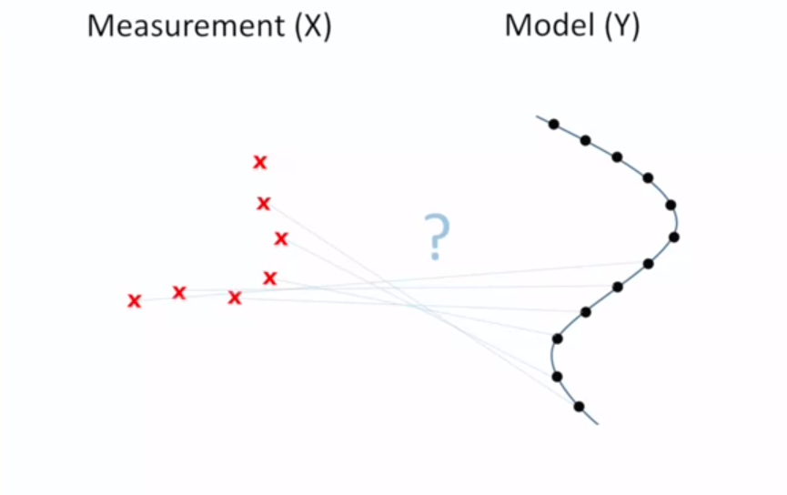

<html>

<head>
	<meta http-equiv="Content-Type" content="text/html; charset=utf-8" />
	<title>ICP</title>
	<link rel="stylesheet" href="Notion_CSS.css">
</head>

<body>
	<article id="9c5e82be-0d12-4625-88b9-e6f20f2e9fbb" class="Notion_P page sans">
		<header>
			
👚

			<h1 class="page-title">ICP</h1>
		</header>
		

			

			

			<blockquote id="5b18e4b2-46f5-46a4-bd91-b2a5aa1ead40" class=""><em><strong>오늘의 발표</strong></em></blockquote>
			<ul id="ba91ee54-88d2-4dfb-a9b9-f96ad2f1544e" class="bulleted-list">
				<li>ICP 이론 : Swimming 🏊‍♀️</li>
			</ul>
			<ul id="17481339-7b81-417b-b8a9-d13882c45452" class="bulleted-list">
				<li>코드 구현 : StrongPine 🌲</li>
			</ul>
			

			

			<nav id="b7b18b7d-a0cf-4ca6-84bc-b5f7706bb5f2" class="block-color-gray table_of_contents">
				
<a class="table_of_contents-link"
						href="#dcc0e10c-c02e-460d-800e-d6011b52a3ff">ICP가 풀고자 하는 것</a>

				
<a class="table_of_contents-link"
						href="#ca5ad59c-5395-47d2-ad7d-ac8169db5fca">Least-Squares Fitting of Two 3-D Point Sets</a>
				

				
<a class="table_of_contents-link"
						href="#a22a8eda-ec2a-485e-9a19-418aefcb628f">👦 우리 나름대로의 해석!</a>

				
<a class="table_of_contents-link"
						href="#3fdd323a-b004-4c5e-a657-cfd067e0e515">그럼 이걸 어떻게 찾죠 ❓❓</a>

				
<a class="table_of_contents-link"
						href="#573fb309-4561-4472-85df-b03a428ab63c"> translation은요 ❓❓</a>

				
<a class="table_of_contents-link"
						href="#2e942267-674d-4a58-84e6-df2ab503e05e"><strong>C</strong>orrespondence는요 ❓❓</a>

				
<a class="table_of_contents-link"
						href="#b41b78af-bd74-4c11-b387-5ac4bde65aa8">Paper</a>

			</nav>
			<h2 id="dcc0e10c-c02e-460d-800e-d6011b52a3ff" class="">ICP가 풀고자 하는 것</h2>
			<ol id="4ae3120f-ab33-451e-a452-162947cc8515" class="numbered-list" start="1">
				<li><strong>R</strong>otation and <strong>t</strong>ranslation matrix</li>
			</ol>
			<ol id="57df0dad-7e7d-4e92-8978-dfc96eb054f9" class="numbered-list" start="2">
				<li><strong>C</strong>orrespondence</li>
			</ol>
			<figure id="0b409c45-4e68-476e-a502-cc1d8d5eba5c" class="image"></figure>
			<blockquote id="0bc8d1ff-ae42-4d10-909d-a199facfaadd" class=""><strong>Assumption</strong>: 가장 가까운 지점이
				correspondence일 것이다.</blockquote>
			<figure id="986a939a-c649-48cc-8c7d-50f1fc4d735e" class="image"></figure>
			<figure id="ddfb9354-c563-4591-b3ec-adf404746673" class="image"></figure>
			

				

					

					

				

				

					
<em>Slides from.. </em>

					<figure id="3d2ab180-07b2-4854-b90b-a018cf0acb2e" class="image">
					</figure>
					

					

					

					

				

			

			

			<h3 id="ca5ad59c-5395-47d2-ad7d-ac8169db5fca" class="">Least-Squares Fitting of Two 3-D Point Sets</h3>
			<ul id="e1dd9a8b-aff6-48f5-a1aa-bc1ebcd63b0f" class="bulleted-list">
				<li>우리가 풀고자 하는 문제는 이러한 상황에서 <code>Least Square</code>를 통해 <code>sigma</code>를 최소화시키는 R,t를 찾는 것 입니다.</li>
			</ul>
			<figure id="138a6b3a-2a5a-4f4e-a811-a4a322b8bff9" class="image"></figure>
			<figure id="d4397fd2-d105-4482-b1a5-995668d87d45" class="image"></figure>
			<ul id="2f041979-722d-4f32-ac96-f1274b856f61" class="bulleted-list">
				<li>음... 3개 항이 있는데요 항 하나를 제거할 수는 없을까요??</li>
			</ul>
			

			

			<blockquote id="19dad847-6062-446c-86f4-f7947891bce7" class="">Translation term을 제거하기 위해 <strong>centroid
				</strong>개념을 도입</blockquote>
			

				

					<figure id="3c3863f3-c382-4b56-94a1-e5c8cb70e629" class="image">
					</figure>
					

					

				

				

					<figure id="586df089-6da2-4da0-a4f6-8c69ce816b93" class="image">
					</figure>
					<figure id="d51f0faf-1ee3-4396-b8c7-d0a625240cc1" class="image">
					</figure>
					<figure class="block-color-gray_background callout" style="white-space:pre-wrap;display:flex"
						id="90199dbd-aac5-48df-8ca0-9b299a048d79">
						
💡

						
중심을 기준으로는 같은 차이!!

					</figure>
					

					

				

			

			
좋습니다 😉 그럼 이제 이 식을 전개해봅니다.

			

			

			<ul id="5b9cb947-5966-4977-a75c-9b28d95707e5" class="bulleted-list">
				<li>sigma를 최소화 하기 위해서는 마지막 차분 항이 최대가 되어야겠네요!! 이를 위한 R값을 구해봅시다.</li>
			</ul>
			<figure id="0607f48f-684e-4eb1-a312-797adc436af4" class="image"></figure>
			<ul id="0ba28f4c-ff02-4fdc-9453-473e28d22590" class="bulleted-list">
				<li>어떤 R이 이 값을 최대로 만들까요??</li>
			</ul>
			

			

			

			<h3 id="a22a8eda-ec2a-485e-9a19-418aefcb628f" class="">👦 우리 나름대로의 해석!</h3>
			

			

			
R은 어떤 행렬일까요?

			<ol id="4062bcb8-132e-490c-8206-770e1c9f5c5c" class="numbered-list" start="1">
				<li>행렬곱은 기하학적으로 <strong>내적</strong>의 의미를 가집니다.</li>
			</ol>
			<ol id="89c408e3-0a64-481c-95fb-c7c9b9c605ca" class="numbered-list" start="2">
				<li>내적을 최대로 만드는 theta 값은??</li>
			</ol>
			

				

					<figure id="326c4bfb-6982-4a16-8c33-3debee540e98" class="image"></figure>
					

					

				

				

					<figure id="610d8a30-e28d-42fa-a6c3-56c77213b13d" class="image"></figure>
					

					

				

			

			
우리가 찾고자 하는 R은 두 point cloud들 사이의
				<code>Rotation Matrix</code>가 입니다.
			

			

			

			<h3 id="3fdd323a-b004-4c5e-a657-cfd067e0e515" class="">그럼 이걸 어떻게 찾죠 ❓❓</h3>
			<ul id="abd4f980-5959-42ad-aa81-ed2fe91cf395" class="bulleted-list">
				<li>Least Square Problem</li>
			</ul>
			<ul id="3a81cdab-a49b-4cb0-b93d-f24a5afaa141" class="bulleted-list">
				<li>SVD &amp; Pseudo inverse</li>
			</ul>
			<figure id="bb0023e9-197c-4579-a206-cb8116e923dc" class="image"></figure>
			<figure id="658bd57c-e835-4e53-946c-6519564a6bf7" class="image"></figure>
			<ul id="b3eff42d-db53-40f2-ad32-43a740c67e2c" class="bulleted-list">
				<li>우리의 경우</li>
			</ul>
			<figure id="197b3d7b-f5a3-4193-8c03-42c937719156" class="image"></figure>
			
<em>image from : </em><em><a
						href="http://blog.naver.com/infoefficien/220790846543">http://blog.naver.com/infoefficien/220790846543</a></em>
			

			

			

			<blockquote id="afa6bc13-389e-4587-95f4-88371ee4c04e" class="">H inverse가 없으면...? ⇒ <code>SVD</code> ⇒
				<code>Pseudo Inverse</code>
			</blockquote>
			<figure id="87ac517c-edd4-46b1-8add-541d56ea8702" class="image"></figure>
			
<em>image from : </em><em><a
						href="https://angeloyeo.github.io/2019/08/01/SVD.html">https://angeloyeo.github.io/2019/08/01/SVD.html</a></em>
			

			

			

			<ul id="d93da26a-5a1a-486a-9057-9443bae108ba" class="bulleted-list">
				<li>R은 회전 행렬이기 때문에 <strong>Σ = I</strong></li>
			</ul>
			<figure id="841f8383-e611-454e-a325-0b48493257e9" class="image"></figure>
			<figure class="block-color-gray_background callout" style="white-space:pre-wrap;display:flex"
				id="d7d72121-42ee-4c8d-b95b-6c0c5bdb9564">
				
💡

				
<strong>Exception</strong> : <strong>determinant</strong>가 -1인 경우 (크기는 같지만, 방향이
					반대)

			</figure>
			<figure id="ed2df503-fccc-41ba-843f-5493678f41b8" class="image"></figure>
			<h3 id="573fb309-4561-4472-85df-b03a428ab63c" class=""> translation은요 ❓❓</h3>
			
<code>centroid</code>의 차이로 계산!!

			<figure id="e9a983a3-3cd5-4385-86d4-b92b23251a07"><a
					href="https://github.com/ClayFlannigan/icp/blob/master/icp.py" class="bookmark source">
					

						

							
ClayFlannigan/icp

							
iterative closest point. Contribute to ClayFlannigan/icp
								development by creating an account on GitHub.

						

						
https://github.com/ClayFlannigan/icp/blob/master/icp.py
						

					

				</a></figure>
			
			<pre id="4818d31a-deea-4083-aca4-f94b81fde106"
				class="code"><code>def best_fit_transform(A, B):
    '''
    Calculates the least-squares best-fit transform that maps corresponding points A to B in m spatial dimensions
    Input:
      A: Nxm numpy array of corresponding points
      B: Nxm numpy array of corresponding points
    Returns:
      T: (m+1)x(m+1) homogeneous transformation matrix that maps A on to B
      R: mxm rotation matrix
      t: mx1 translation vector
    '''

    assert A.shape == B.shape

    # get number of dimensions
    m = A.shape[1]

    # translate points to their centroids
    centroid_A = np.mean(A, axis=0)
    centroid_B = np.mean(B, axis=0)
    AA = A - centroid_A
    BB = B - centroid_B

    # rotation matrix
    H = np.dot(AA.T, BB)
    U, S, Vt = np.linalg.svd(H)
    R = np.dot(Vt.T, U.T)

    # special reflection case
    if np.linalg.det(R) &lt; 0:
       Vt[m-1,:] *= -1
       R = np.dot(Vt.T, U.T)

    # translation
    t = centroid_B.T - np.dot(R,centroid_A.T)

    # homogeneous transformation
    T = np.identity(m+1)
    T[:m, :m] = R
    T[:m, m] = t

    return T, R, t</code></pre>
			

			

			

			

			<h3 id="2e942267-674d-4a58-84e6-df2ab503e05e" class=""><strong>C</strong>orrespondence는요 ❓❓</h3>
			<ul id="c09abe7e-4a5e-44e8-a5f1-227206cdcd60" class="bulleted-list">
				<li>In real Lidar SLAM...</li>
			</ul>
			

				

					<figure id="cc9c4a5a-9d59-407c-8384-2c3639152383" class="image"></figure>
				

				

					<figure id="a7c3079b-62d8-4403-a830-e08302876900" class="image"></figure>
					

					

				

			

			
slides from : <a
					href="http://www2.informatik.uni-freiburg.de/~stachnis/pdf/rbpf-slam-tutorial-2007.pdf">http://www2.informatik.uni-freiburg.de/~stachnis/pdf/rbpf-slam-tutorial-2007.pdf</a>
			

			<figure class="block-color-gray_background callout" style="white-space:pre-wrap;display:flex"
				id="a4afca8a-59c5-4e5c-a2a4-09d9f7a2eca8">
				
💡

				
<em><strong>homogeneous transformation</strong></em> 이란?

			</figure>
			<figure id="550b507c-26fa-4f8f-90ec-a3cca7b8f685" class="image"></figure>
			

			

			
<strong>T</strong>ranslation과
				<strong>R</strong>otation을
			

			<ol id="74231704-5a7d-4534-8937-a081d1f165c4" class="numbered-list" start="1">
				<li>하나의 행렬로 </li>
			</ol>
			<ol id="a4f02367-828d-4cd2-85a6-3309d4e5f4ea" class="numbered-list" start="2">
				<li>Linear 연산으로 표현하기 위해</li>
			</ol>
			
<em><strong>Homogeneous transformation</strong></em>을
				사용합니다.

			

			

			<h3 id="b41b78af-bd74-4c11-b387-5ac4bde65aa8" class="">Paper</h3>
			

			<figure id="570a3105-bcc0-4338-a45b-b07051874655">
				
<a
						href="Images/icp.pdf">https://s3-us-west-2.amazonaws.com/secure.notion-static.com/5887703e-c052-4f3e-92b6-31d3406a3fe9/icp.pdf</a>
				

			</figure>
			

			

			<ul id="3ff2b4d9-9d86-4722-92b9-da2b01065db0" class="toggle">
				<li>
					

						
그럼... 드디어....

						<h2 id="50124189-f721-4039-b8a7-d28a50d4de78" class="">한솔님과 함께하는 즐거운 코딩 시간🏄‍♂️</h2>
						<figure id="0ffa3854-12eb-4b82-9cfa-3f74dc4980a4" class="image"></figure>
						<figure id="1beec64a-8011-4c0a-86d7-0aa5405a853f" class="image"></figure>
						<figure id="5e56ed40-2c8a-4c66-8bbe-af11fb6b746e" class="image"></figure>
					

				</li>
			</ul>
			

			

		

	</article>
</body>

</html>